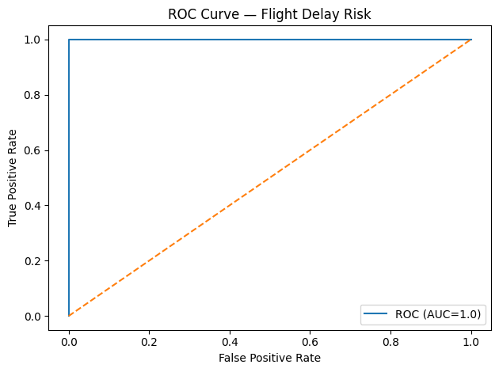

---

## 📊 Metrics & Results



## 📦 Installation & Usage
```bash
# Clone the repository
git clone https://github.com/saidnoor-bot/aws-sagemaker-flight-delays.git
cd aws-sagemaker-flight-delays

# (Optional) Create and activate virtual environment
python -m venv .venv && source .venv/bin/activate

# Install dependencies
pip install -r requirements.txt

# Run evaluation
MPLBACKEND=Agg python -m src.evaluate

## 📸 Demo & Screenshots

Below are example outputs and diagrams from the project:

### Model ROC Curve


### Architecture Diagram
(See diagram above in the Architecture section)

