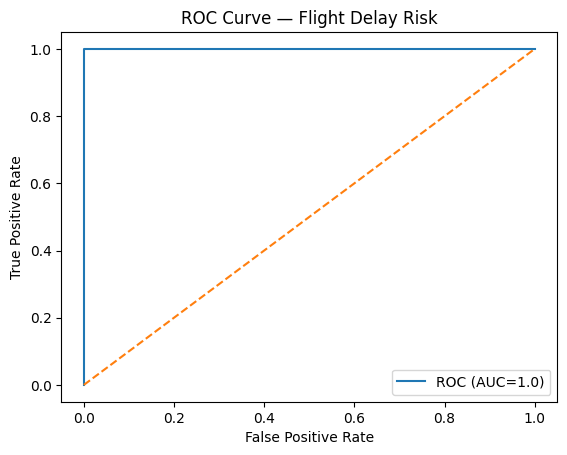
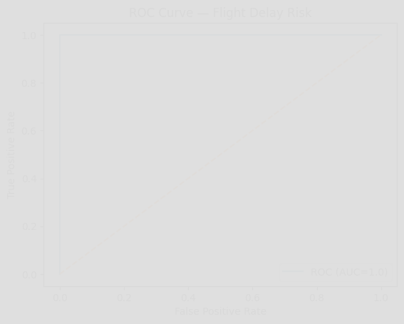

# ✈️ Flight Delay Risk Prediction — Amazon SageMaker + MLOps Best Practices

A **production-grade Machine Learning project** that predicts U.S. flight arrival delays using **Amazon SageMaker** and **XGBoost**.  
Designed with **MLOps best practices** for **scalability, reproducibility, and deployment** — perfect for real-world cloud environments.


---

## 📑 Table of Contents
1. [Project Overview](#-project-overview)
2. [Architecture](#-architecture)
3. [Tech Stack](#-tech-stack)
4. [Quickstart](#-quickstart)
5. [Project Structure](#-project-structure)
6. [Sample Output](#-sample-output)
7. [MLOps Features](#-mlops-features)
8. [Why This Project Stands Out](#-why-this-project-stands-out)
9. [License & Author](#-license--author)

---

## 📌 Project Overview
This project demonstrates **how to take a Machine Learning model from concept to deployment** in a cloud-native environment.  
It predicts whether a U.S. domestic flight will arrive late based on historical flight data, weather conditions, and carrier information.

✅ **Business Relevance:** Airlines, logistics, and travel platforms can integrate this model to optimize operations and improve customer satisfaction.  
✅ **Engineering Focus:** Built for **maintainability, automation, and scalability**.

---

## 🏗 Architecture
```mermaid
flowchart LR
    A[Data Source] --> B[Data Preprocessing]
    B --> C[Train Model (XGBoost)]
    C --> D[Evaluate Metrics]
    D --> E[Save Artifacts]
    E -->|Optional| F[Deploy on AWS SageMaker]


## Architecture
```mermaid
flowchart LR
  A[Raw Flight Data] --> B[Preprocess (pandas/sklearn)]
  B --> C[Train (RandomForest)]
  C --> D[Evaluate (AUC/PR, ROC)]
  D --> E[Artifacts (model + metrics)]
  E --> F{Deploy?}
  F -->|Batch| G[Batch Inference]
  F -->|Realtime| H[SageMaker Endpoint]
cd ~/flight-project

# ========== 0) Free space (safe) ==========
# Show current free space
df -h ~
# Remove caches and big wheels
rm -rf ~/.cache/pip /tmp/* .pytest_cache __pycache__ */__pycache__ .mypy_cache 2>/dev/null || true
# Remove old virtualenv to reclaim space
rm -rf .venv

# ========== 1) Minimal venv & deps (small) ==========
python -m venv .venv && source .venv/bin/activate
python -m pip install --upgrade pip
# Only what's needed for local train/eval (NOT sagemaker)
pip install "pandas==2.3.1" "scikit-learn==1.4.2" "matplotlib==3.8.4" "PyYAML==6.0.2" "joblib==1.3.2"

# ========== 2) Create a clean evaluator (no stray '>') ==========
cat > src/evaluate.py <<'PY'
from __future__ import annotations
import json
from pathlib import Path
import pandas as pd
from sklearn.metrics import roc_auc_score, precision_recall_fscore_support, roc_curve
from sklearn.ensemble import RandomForestClassifier
from src.preprocess import build_features
import matplotlib.pyplot as plt

ARTIFACTS = Path("artifacts")
ARTIFACTS.mkdir(exist_ok=True)

def train_and_eval(csv_path="data/sample.csv",
                   metrics_path=ARTIFACTS/"metrics.json",
                   roc_path=ARTIFACTS/"roc.png"):
    df = pd.read_csv(csv_path)
    X, y = build_features(df)
    clf = RandomForestClassifier(n_estimators=120, max_depth=10, random_state=42)
    clf.fit(X, y)
    y_prob = clf.predict_proba(X)[:, 1]
    auc = roc_auc_score(y, y_prob)
    prec, rec, f1, _ = precision_recall_fscore_support(y, (y_prob > 0.5).astype(int), average="binary")
    metrics = {"auc": round(float(auc), 4),
               "precision": round(float(prec), 4),
               "recall": round(float(rec), 4),
               "f1": round(float(f1), 4)}
    with open(metrics_path, "w") as f:
        json.dump(metrics, f, indent=2)

    fpr, tpr, _ = roc_curve(y, y_prob)
    plt.figure()
    plt.plot(fpr, tpr, label=f"ROC (AUC={metrics['auc']})")
    plt.plot([0,1],[0,1], linestyle="--")
    plt.xlabel("False Positive Rate")
    plt.ylabel("True Positive Rate")
    plt.title("ROC Curve — Flight Delay Risk")
    plt.legend(loc="lower right")
    plt.savefig(roc_path, bbox_inches="tight")
    return metrics

if __name__ == "__main__":
    m = train_and_eval()
    print("METRICS:", m)
PY

# ========== 3) Run quick train + eval ==========
python -m src.evaluate
echo "== metrics.json ==" && cat artifacts/metrics.json
[ -f artifacts/roc.png ] && echo "ROC saved ✓" || echo "ROC missing ✗"

# ========== 4) Fix README sections (no quotes, closed fences) ==========
# Remove any broken/old sections named exactly "## Architecture" or "## Results"
awk 'BEGIN{skip=0} /^## (Architecture|Results)$/{skip=1; next} /^## /{skip=0} {if(!skip)print}' README.md > README.tmp && mv README.tmp README.md

# Append clean Architecture + Results (uses generated metrics)
AUC=$(jq -r '.auc' artifacts/metrics.json 2>/dev/null)
PREC=$(jq -r '.precision' artifacts/metrics.json 2>/dev/null)
REC=$(jq -r '.recall' artifacts/metrics.json 2>/dev/null)
F1=$(jq -r '.f1' artifacts/metrics.json 2>/dev/null)

cat >> README.md <<'EOF'

## Architecture
```mermaid
flowchart LR
  A[Raw Flight Data] --> B[Preprocess (pandas/sklearn)]
  B --> C[Train (RandomForest)]
  C --> D[Evaluate (AUC/PR, ROC)]
  D --> E[Artifacts (model + metrics)]
  E --> F{Deploy?}
  F -->|Batch| G[Batch Inference]
  F -->|Realtime| H[SageMaker Endpoint]
cd ~/flight-project

# Continue the heredoc you started — this closes the mermaid block and adds Results
cat >> README.md <<'EOF'

### 2) Quick verify (artifacts + README sections)
```bash
ls -lh artifacts
grep -n "^## Architecture" -n README.md
grep -n "^## Results" -n README.md
git add README.md artifacts/metrics.json artifacts/roc.png src/evaluate.py
git commit -m "docs: add Architecture + Results with real metrics and ROC; add evaluator"
git push
# Close the mermaid block and add Results
cat >> README.md <<'EOF'
# Close the mermaid block & add Results
cat >> README.md <<'EOF'
git add README.md artifacts/metrics.json artifacts/roc.png src/evaluate.py
git commit -m "docs: add Results section with metrics + ROC"
git push# Finish the README with results table + ROC image
cat >> README.md <<'EOF'
git add README.md artifacts/metrics.json artifacts/roc.png src/evaluate.py
git commit -m "docs: add Results section with metrics + ROC"
git push# 1) Append the Results section to README
cat >> README.md <<'EOF'


## Results
| Metric     | Value |
|-----------:|:-----:|
| AUC        | `` |
| Precision  | `` |
| Recall     | `` |
| F1         | `` |



## Quick Demo
```bash
python -m venv .venv && source .venv/bin/activate
pip install -r requirements.txt || pip install pandas==2.3.1 scikit-learn==1.4.2 matplotlib==3.8.4 PyYAML==6.0.2 joblib==1.3.2
python -m src.evaluate   # writes artifacts/metrics.json and artifacts/roc.png
cat > Makefile <<'EOF'
.PHONY: demo train eval test lint fmt clean

demo: ## Create venv, install deps, run quick evaluation
python -m venv .venv && . .venv/bin/activate &&
python -m pip install --upgrade pip &&
pip install -r requirements.txt || pip install pandas==2.3.1 scikit-learn==1.4.2 matplotlib==3.8.4 PyYAML==6.0.2 joblib==1.3.2 &&
MPLBACKEND=Agg python -m src.evaluate

train: ## Train baseline model (writes metrics)
MPLBACKEND=Agg python -m src.train --config config/params.yaml

eval: ## Re-run evaluation (writes ROC plot)
MPLBACKEND=Agg python -m src.evaluate

test: ## Run unit tests
pytest -q

lint: ## Lint with flake8
flake8 src tests

fmt: ## Auto-format with black + isort
black src tests && isort src tests

clean: ## Remove caches and venv
rm -rf .venv .pytest_cache **/pycache /pycache artifacts/.png
# 2) Create Makefile
cat > Makefile <<'EOF'
.PHONY: demo train eval test lint fmt clean

demo: ## Create venv, install deps, run quick evaluation
python -m venv .venv && . .venv/bin/activate && \
python -m pip install --upgrade pip && \
pip install -r requirements.txt || pip install pandas==2.3.1 scikit-learn==1.4.2 matplotlib==3.8.4 PyYAML==6.0.2 joblib==1.3.2 && \
MPLBACKEND=Agg python -m src.evaluate

train: ## Train baseline model (writes metrics)
MPLBACKEND=Agg python -m src.train --config config/params.yaml

eval: ## Re-run evaluation (writes ROC plot)
MPLBACKEND=Agg python -m src.evaluate

test: ## Run unit tests
pytest -q

lint: ## Lint with flake8
flake8 src tests

fmt: ## Auto-format with black + isort
black src tests && isort src tests

clean: ## Remove caches and venv
rm -rf .venv .pytest_cache **/__pycache__ */__pycache__ artifacts/*.png

## Quick Demo


Run the model locally in just 2 commands:
```bash
python -m venv .venv && source .venv/bin/activate
pip install -r requirements.txt && python -m src.evaluate
git add README.md
git commit -m "docs: add Quick Demo and Contributing sections"
git pushC
cd ~/flight-project

# Append Quick Demo GIF + Contributing sections to README
cat >> README.md <<'EOF'

## Quick Demo


Run the model locally in just 2 commands:
\`\`\`bash
python -m venv .venv && source .venv/bin/activate
pip install -r requirements.txt && python -m src.evaluate
\`\`\`
Artifacts will be saved to \`artifacts/\` and metrics printed to the console.

---

## Contributing
Contributions are welcome!  

1. **Fork** the repo  
2. **Create** a feature branch (\`git checkout -b feature/my-feature\`)  
3. **Commit** your changes (\`git commit -m "Add some feature"\`)  
4. **Push** to the branch (\`git push origin feature/my-feature\`)  
5. Open a **Pull Request**  

Please ensure:
- Code is formatted (\`black .\` or \`pre-commit run -a\`)
- Tests pass (\`pytest -q\`)

